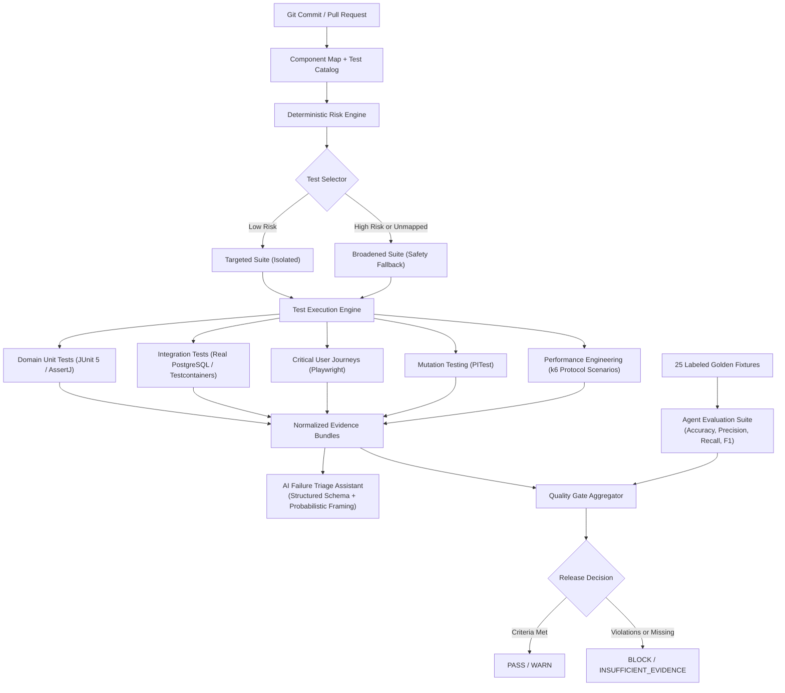

# SentinelQE

**AI-Native Quality Engineering Reference Platform**

A production-like reference platform demonstrating risk-based testing, deterministic automation, AI-assisted quality intelligence, observability-driven failure triage, performance engineering, mutation testing, and release quality gates.

---

## What Problem Does This Solve?

Modern software engineering teams frequently write hundreds or thousands of automated tests, yet they still struggle to answer the critical questions that determine delivery speed and operational stability:

- **What changed?** Can we reliably map changed source files to business domains?
- **What is at risk?** How do we differentiate a low-risk UI text update from a high-risk financial calculation change?
- **What should run?** How can PR pipelines run targeted tests without risking false negatives?
- **Why did a test fail?** Is the failure caused by a product defect, test defect, environment outage, dirty test data, or flakiness?
- **Can AI safely help?** How can LLMs assist triage without becoming an unvalidated, hallucinating liability?
- **Is this version safe to release?** How do we base release decisions on genuine, cryptographically verifiable quality evidence rather than green checkboxes and hope?

**SentinelQE demonstrates how to design a quality system, not merely write test scripts.**

---

## Architecture

SentinelQE is built around a realistic domain application: **WorkforceOps**, a modular HR and workforce management SaaS platform.

### System Architecture


### Quality Engineering Architecture



---

## Core Engineering Capabilities

### 1. Test Portfolio & Invariant-Focused Automation
SentinelQE avoids trivial assertions (`expect(status).toBe(200)`). Every test layer validates business invariants:
- **Unit Tests (JUnit 5, AssertJ)**: Verifies pure domain invariants (inclusive date ranges, positive durations, banker's rounding on tax and deductions, strict two-decimal cent precision).
- **Integration Tests (Testcontainers, PostgreSQL)**: Tests transactional integrity, Flyway migrations, foreign key constraints, and pessimistic row locks (`PESSIMISTIC_WRITE`) preventing concurrent leave overspending.
- **API Tests (REST Assured)**: Verifies authorization boundaries, token expiration, idempotency, and state machine transitions.
- **E2E Journeys (Playwright)**: Focused exclusively on critical user journeys using semantic accessibility locators (`getByRole`, `getByLabel`), trace collection, and failure screenshot artifacts.

### 2. AI Quality Intelligence & Guardrails
AI quality assistance is explicitly bounded by deterministic engineering:
- **Change Risk Analyzer & Test Selector**:
  - Maps source files to business risk scores (`Impact × Likelihood`).
  - Deterministic rules select tests based on affected components.
  - **Safety Broadening Rule**: If changed files touch unmapped paths, shared configurations, or quality tooling, the engine automatically broadens test coverage rather than aggressively skipping tests. False negatives are treated as more dangerous than extra test runs.
- **Failure Triage Assistant**:
  - Ingests normalized failure evidence bundles (stack traces, HTTP status, correlation IDs, backend logs, console logs).
  - Classifies failures into six strict categories: `PRODUCT_DEFECT`, `TEST_DEFECT`, `ENVIRONMENT`, `TEST_DATA`, `FLAKY_TEST`, `UNKNOWN`.
  - Enforces schema validation (`TriageResultSchema`) with confidence scores and recommended owners (`backend`, `frontend`, `devops`, `qa`).
  - Strict probabilistic language: Never claims "AI determined root cause"; always frames recommendations as *"AI-assisted triage suggests..."*.
- **Guarded Test Healer**:
  - Analyzes broken locators and timing issues.
  - **Strict Guardrails**: Explicitly prohibits weakening assertions (e.g. converting `toBe(val)` to `toBeDefined()`), deleting assertions, adding `.skip`, increasing timeouts unconditionally, or modifying production code.
  - Generates unified git diff patches for human engineer review; **never auto-commits**.

### 3. Agent Evaluation Platform
AI quality tools are evaluated like machine learning models against a labeled benchmark dataset:
- **Golden Dataset**: 25 realistic, hand-curated failure bundles (`agent-evals/datasets/failure-triage/`).
- **Standardized Metrics**: Evaluates Accuracy, Precision, Recall, Macro F1, Confusion Matrix, and UNKNOWN rate.
- **Prompt Regression Testing**: Prompt templates are versioned under `quality-intelligence/prompts/` to ensure prompt iterations improve accuracy and don't introduce regressions.

### 4. Observability-Driven Debugging & Correlation IDs
Every request—whether initiated by a browser journey, an API test, or a k6 virtual user—attaches an `X-Correlation-ID` header:
- **Failure Traceability Flow**:
  `Failed Test ID` $\rightarrow$ `HTTP Status Code` $\rightarrow$ `X-Correlation-ID` $\rightarrow$ `Backend Spring Logs` $\rightarrow$ `OpenTelemetry Span / Jaeger Trace`.
- Application logs correlate trace IDs and span IDs directly with domain transactions.

### 5. Mutation Testing (PITest)
- High line coverage does not guarantee test effectiveness. SentinelQE uses PITest against core business logic (`LeavePolicy`, `PayrollCalculator`, `PayrollPolicy`, `AccessPolicy`).
- **Verified Score**: Generated 45 mutations, **killed 44 (98% test strength)** with 89% line coverage.

### 6. Controlled Defect Seeds
The repository contains flag-controlled defect injection mechanisms (`defect-seeds/`) to verify that the quality system detects real regressions:
- `DEFECT_SEED_DOUBLE_FINALIZE`: Disables payroll finalization checks.
- `DEFECT_SEED_SLOW_PAYROLL`: Injects latency into batch payroll processing.
- `DEFECT_SEED_WRONG_TAX`: Alters the tax calculation algorithm.
- `DEFECT_SEED_BYPASS_MANAGER`: Disables manager authorization checks.
- **Safety**: Off by default; strictly rejected unless running with the explicit `demo` Spring profile.

### 7. Quality Gate Aggregator
The Quality Gate (`quality-gate/`) aggregates real artifacts from all testing tools:
- Checks report freshness against configured `maxAgeHours`.
- Verifies cryptographic SHA-256 hashes and run manifests.
- Evaluates against PR, Nightly, and Release profiles.
- Outputs machine-readable `reports/quality-gate.json` and human-readable `reports/quality-gate.md`.
- Distinguishes missing evidence from passing checks: Missing reports trigger **`INSUFFICIENT_EVIDENCE`**, never `PASS`.

---

## Local Quick Start

### Prerequisites
- Java 21 LTS
- Node.js 20+ and npm 10+
- Docker and Docker Compose (optional for full containerized stack)

### 1. Build and Run Local Tests
```bash
# Clone repository
git clone https://github.com/example/sentinel-qe.git
cd sentinel-qe

# Install Node dependencies
npm install

# Run backend unit tests (90 domain tests)
npm run test:backend

# Run mutation testing (PITest)
npm run mutation

# Run TypeScript quality intelligence & quality gate tests
npm run test:unit

# Run agent evaluations against golden dataset
npm run agent-evals

# Build frontend production bundle
npm run build --workspace frontend
```

### 2. Quality Intelligence CLI Commands
```bash
# Intelligent test selection based on changed files
npm run quality:select-tests -- --changed backend/src/main/java/io/sentinelqe/workforce/payroll/PayrollService.java

# Run failure triage assistant on a failure bundle
npm run quality:triage -- agent-evals/datasets/failure-triage/ft-001-product-defect.json

# Analyze flaky test patterns across historical runs
npm run quality:flaky

# Run guarded test healer demonstration
npx tsx quality-intelligence/src/guarded-healer/cli.ts

# Evaluate release quality gate
npm run quality:gate -- --profile pr
```

### 3. Running with Docker Compose (Full Stack)
```bash
# Start PostgreSQL, Backend, Frontend
docker compose up -d

# Start with observability profile (OTel Collector, Prometheus, Grafana, Jaeger)
docker compose --profile observability up -d
```

---

## Repository Structure

```text
sentinel-qe/
├── backend/                  # Java 21 Spring Boot modular monolith
│   ├── src/main/java/        # Domain: auth, employee, leave, payroll, audit
│   ├── src/test/java/        # Domain unit tests & Testcontainers IT tests
│   └── pom.xml               # Maven configuration with PITest & Failsafe
├── frontend/                 # React 19 + TypeScript + Vite UI
│   └── src/                  # Accessible UI components & mock/proxy integration
├── quality/                  # Quality engineering metadata
│   ├── component-map.yml     # Source paths to component risk mapping
│   ├── test-catalog.yml      # Machine-readable test catalog with IDs & tags
│   ├── requirements.yml      # Traceability matrix
│   └── quality-gate.yml      # Gate thresholds and required profiles
├── quality-intelligence/     # AI Quality Intelligence tooling
│   ├── src/providers/        # AiProvider interface, MockAiProvider, RealAiProvider
│   ├── src/test-selector/    # Risk analyzer & deterministic test selection CLI
│   ├── src/failure-triage/   # Schema-validated triage assistant & evidence model
│   ├── src/guarded-healer/   # Guarded patch generator with strict guardrails
│   ├── src/flaky-analysis/   # Flakiness index and retry analyzer
│   └── prompts/              # Versioned prompts for regression testing
├── agent-evals/              # Agent evaluation benchmarking platform
│   ├── datasets/             # 25 labeled golden failure fixtures
│   └── evaluator/            # Evaluator computing accuracy, F1, confusion matrix
├── quality-gate/             # Quality gate evidence aggregator
│   ├── src/                  # Report normalizers (JUnit, Playwright, k6, PIT, evals)
│   └── test/                 # Test suite for quality gate logic
├── performance/              # k6 performance engineering scenarios
│   ├── smoke.js              # Protocol smoke verification
│   ├── baseline.js           # Steady-state baseline workload
│   └── stress.js             # High-concurrency stress scenario
├── defect-seeds/             # Flag-controlled defect injection documentation
├── docs/                     # Engineering architecture & strategy documentation
│   ├── ARCHITECTURE.md       # Modular monolith architecture & data model
│   ├── TEST_STRATEGY.md      # Risk-based test portfolio strategy
│   ├── PERFORMANCE_STRATEGY.md# Workload models, SLIs, and k6 thresholds
│   ├── RISK_MODEL.md         # Impact × Likelihood risk formulation
│   ├── SECURITY_TESTING.md   # Object-level authorization & BOLA matrix
│   ├── AI_GUARDRAILS.md      # Rules and constraints governing AI quality tools
│   ├── DEMO.md               # 5-10 minute portfolio demonstration walkthrough
│   ├── EVIDENCE.md           # Authentic execution evidence from tool runs
│   ├── FINAL_VERIFICATION.md # Verified execution matrix and limitations
│   └── adr/                  # Architecture Decision Records (ADR 001 - 008)
└── .github/workflows/        # CI/CD pipelines (PR, Nightly, Release)
```

---

## Architecture Decision Records (ADRs)

Key architectural decisions are documented in [docs/adr/](docs/adr/):
- **[ADR-001](docs/adr/001-modular-monolith.md)**: Why Modular Monolith instead of Microservices.
- **[ADR-002](docs/adr/002-playwright.md)**: Why Playwright for User Journeys.
- **[ADR-003](docs/adr/003-java-api-tests.md)**: Why Java REST Assured for Contract Tests.
- **[ADR-004](docs/adr/004-real-postgresql.md)**: Why Testcontainers with Real PostgreSQL instead of H2.
- **[ADR-005](docs/adr/005-deterministic-ai-boundaries.md)**: Why AI Decisions Require Deterministic Fallbacks.
- **[ADR-006](docs/adr/006-performance-schedule.md)**: Why Performance Workloads Run on Nightly Schedules rather than PRs.
- **[ADR-007](docs/adr/007-guarded-healing.md)**: Why AI Test Healing is Conservative and Guarded.
- **[ADR-008](docs/adr/008-domain-invariants.md)**: Domain Invariants and Financial Decimals.

---

## Known Limitations & Honest Engineering Boundary
- **Testcontainers & Docker Engine**: Running PostgreSQL integration tests and live Playwright tests requires a running Docker daemon. On environments where Docker Desktop is stopped, these tests are marked `NOT VERIFIED` rather than assuming success.
- **Local k6 Runtime**: k6 scenarios require the k6 binary installed locally or executed via container.
- **Deterministic AI Baseline**: By default, SentinelQE uses `MockAiProvider` to guarantee zero-cost, zero-credential CI repeatability. Real LLM providers can be activated via `AI_PROVIDER` and `AI_API_KEY`.

---

## License
MIT License. See [LICENSE](LICENSE) for details.
