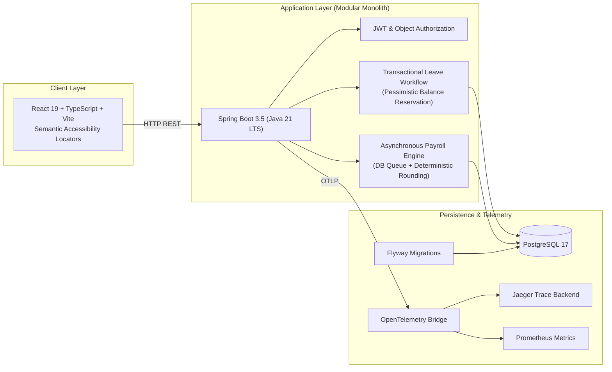
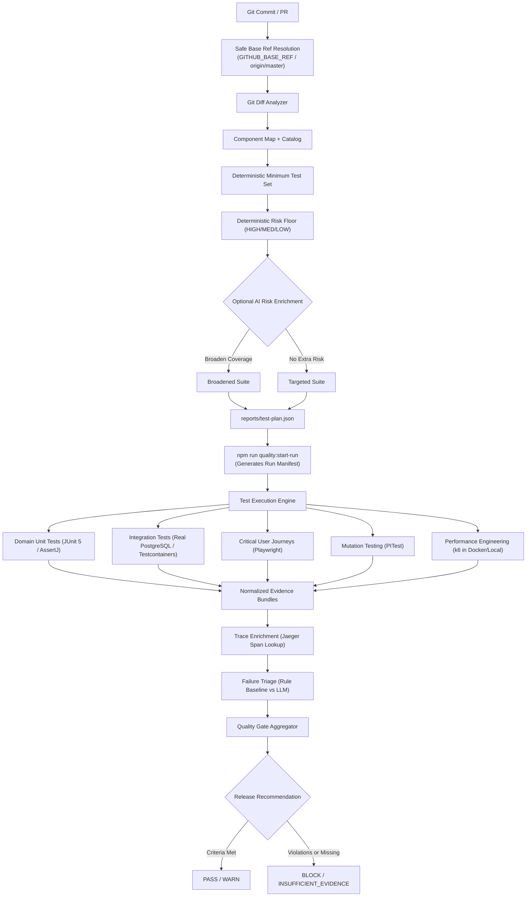

# SentinelQA (SentinelQE Platform)

**Evidence-Backed Quality Engineering Reference Platform**

SentinelQA is an evidence-first Quality Engineering reference platform demonstrating deterministic test selection, risk-based automation, observability-linked failure triage, performance regression monitoring, mutation testing, and cryptographic run-manifest quality gates.

The platform is designed around a single core engineering principle:
> **Deterministic rules establish minimum safe coverage. AI may add tests or enrich analysis, but AI is never permitted to subtract tests, downgrade risk, or override quality gates.**

---

## What Is Deterministic vs AI-Assisted?

| Capability | Deterministic Foundation | AI-Assisted Capability | Strict Safety Boundary |
| :--- | :--- | :--- | :--- |
| **Test Selection** | Component mapping via Git diff; minimum test set; risk floor | Semantic change-risk enrichment; domain broadening | **AI cannot remove deterministic tests or lower risk** |
| **Failure Triage** | Rule-based triage baseline; normalized schema; correlation ID linking | Optional LLM classification (`gpt-4o-mini`, etc.) | **Untrusted data treated strictly as data; prompt injection resisted** |
| **Test Repair** | Strict syntactic & semantic guardrails; assertion preservation | LLM patch generation for broken locators or wait states | **Human approval mandatory; cannot weaken assertions or edit production code** |
| **Quality Gate** | Manifest binding; SHA-256 fingerprinting; freshness policy | None (deterministic gate evaluation only) | **AI cannot override quality gate decisions or suppress failures** |
| **Release Decision** | Profile-based criteria (`PASS`, `WARN`, `BLOCK`, `INSUFFICIENT_EVIDENCE`) | None | **Release gates require verified artifacts produced during the active run** |

---

## System Architecture

SentinelQA exercises a realistic domain application: **WorkforceOps**, a modular HR and workforce management platform.



### Quality Engineering Architecture



---

## Core Quality Engineering Capabilities

### 1. Invariant-Focused Automation Portfolio
SentinelQA avoids superficial UI assertions. Every layer validates domain invariants:
- **Unit Tests (JUnit 5, AssertJ - 90 tests)**: Verifies pure domain invariants (inclusive date ranges, positive durations, banker's half-even rounding on tax and deductions, strict two-decimal cent precision).
- **Integration Tests (Testcontainers, PostgreSQL 17 - 25 tests)**: Verifies Flyway migrations, object-level authorization (`AuthApiIT`), concurrent leave race conditions (`LeaveConcurrencyIT` with pessimistic row locking), and asynchronous payroll polling (`PayrollApiIT`).
- **Critical E2E Journeys (Playwright - 2 journeys)**: Focuses exclusively on core business flows (`E2E-LEAVE-001`, `E2E-PAY-001`) with semantic locators (`getByRole`, `getByLabel`), trace recording, and screenshot artifacts.
- **Test Catalog Integrity (`npm run catalog:verify`)**: Statically scans codebase and verifies all 54 test IDs match between executable tests, requirement specs, and `quality/test-catalog.yml`.

### 2. Intelligent Test Selection with Safety Floor
- **Safe Base Ref Resolution**: Resolves against `--base`, `GITHUB_BASE_REF`, `origin/HEAD`, or `origin/master`, avoiding silent failures or stale branch diffs.
- **Machine-Readable Test Plan**: Generates `reports/test-plan.json` containing selected test IDs, affected components, and required execution layers.
- **Safety Invariant**: AI risk enrichment can elevate risk or add test domains, but cannot remove tests selected by the deterministic engine or downgrade risk level.
- **Simulated PR Benchmark**: Evaluated across 10 realistic PR scenarios (`quality-intelligence/benchmarks/change-impact/`):
  - **0 Critical False Negatives**
  - **100% Critical Recall**
  - **75.9% targeted suite reduction** on low-risk changes

### 3. Rule Baseline vs. Real LLM Triage
We do not assume an LLM is inherently better than deterministic heuristics. We benchmark AI against a fast, zero-cost rule-based baseline:
- **Rule-Based Triage Baseline (`TRIAGE_PROVIDER=rules`)**: Zero-cost, zero-latency classifier with explicit abstention (`UNKNOWN`) on ambiguous failures.
- **Real LLM Provider (`TRIAGE_PROVIDER=openai`)**: Explicit configuration with prompt versioning (`v1`, `v2`). Never quietly falls back to mock if an LLM is requested.
- **Independent Holdout Benchmark (15 cases)**: Unseen adversarial cases including prompt injection attempts, selector timeouts caused by backend errors, race conditions, and ambiguous telemetry.
- **Computed Safety Metrics**: Dynamic policy validator checks that triage recommendations never suggest weakening assertions, skipping tests, or ignoring security errors.

### 4. Observability-Linked Failure Evidence
When tests fail, SentinelQA completes the triage loop:
```text
Test Failure → Correlation ID → Backend Log Search → Jaeger Trace Lookup → Normalized Span Summary → Triage Input
```
- Filters and redacts sensitive credentials (`Authorization` headers, JWTs, passwords).
- Extracts failing span durations and error attributes for root-cause diagnosis.
- Reproducible demonstration documented in [docs/OBSERVABILITY_DEMO.md](docs/OBSERVABILITY_DEMO.md).

### 5. Containerized Performance Regression (k6)
- Evaluates HTTP p95 latency, error rates, and custom business metrics (`leave_transaction_ms`, `payroll_completion_ms`).
- Automatically falls back to containerized execution (`grafana/k6`) when local k6 is not installed on PATH.
- Produces `reports/k6/summary.json` consumed directly by the Quality Gate.
- Reference measurements on CI/local environments are treated as regression indicators, not production capacity certification.

### 6. Mutation Testing (PITest)
- High line coverage does not ensure test efficacy. PITest runs against core domain logic (`LeavePolicy`, `PayrollCalculator`, `PayrollPolicy`, `AccessPolicy`).
- **Verified Mutation Score**: 45 mutations generated, **44 killed (97.8% mutation score)**.

### 7. Cryptographic Run-Manifest Quality Gate
- Quality Gate binds all evaluation to an explicit run manifest (`npm run quality:start-run`).
- Records SHA-256 fingerprints, file modification times, and report timestamps.
- Enforces strict freshness: Reports predating the current run manifest are rejected as `STALE`.
- Profiles:
  - **PR**: Requires unit, integration, security, e2e, and agent evaluations.
  - **Nightly / Release**: Additionally requires performance and mutation testing.

---

## Local Quick Start

### Prerequisites
- Java 21 LTS (`java -version`)
- Node.js 20+ and npm 10+
- Docker & Docker Compose

### 1. Clone & Build
```bash
git clone https://github.com/eyupcanbilgin/SentinelQA.git
cd SentinelQA
npm install
npm run build
```

### 2. Run Deterministic Verification
```bash
# Verify test catalog consistency (no drift between code & catalog)
npm run catalog:verify

# Run test selection benchmark (10 simulated PRs)
npm run quality:benchmark-selection

# Run guarded healer benchmark (guardrail safety)
npm run quality:benchmark-healer

# Run backend unit tests (90 tests)
npm run test:backend

# Run integration tests (25 Testcontainers PostgreSQL tests)
npm run test:integration
```

### 3. Start Full-Stack & Run End-to-End Tests
```bash
# Start PostgreSQL, Backend, Frontend
npm run up

# Run critical Playwright journeys against live stack
npm run test:e2e

# Run k6 performance smoke scenario (via Docker or local k6)
npm run perf:smoke
```

### 4. Evaluate Agent Benchmarks & Quality Gate
```bash
# Start a fresh evidence run manifest
npm run quality:start-run

# Run agent evaluations on development dataset
npm run agent-evals

# Run agent evaluations on independent holdout benchmark
npm run agent-evals:holdout

# Compare rule baseline vs LLM
npm run agent-evals:compare

# Evaluate Quality Gate
npm run quality:gate -- --profile pr
```

---

## Verified Execution Results

| Capability | Scope / Engine | Execution Status | Key Evidence Metric |
| :--- | :--- | :---: | :--- |
| **Backend Unit Tests** | JUnit 5 + AssertJ | **VERIFIED** | 90 / 90 passed (0 failures) |
| **Integration Tests** | Real PostgreSQL + Testcontainers | **VERIFIED** | 25 / 25 passed (`AuthApiIT`, `LeaveApiIT`, `LeaveConcurrencyIT`, `PayrollApiIT`) |
| **Security Tests** | Object authorization & JWT | **VERIFIED** | 4 / 4 critical security IDs verified (`SEC-AUTHZ-001` - `004`) |
| **E2E Critical Journeys** | Playwright (Chromium Headless Shell) | **VERIFIED** | 2 / 2 passed (`E2E-LEAVE-001`, `E2E-PAY-001`) |
| **Performance Smoke** | k6 containerized runner | **VERIFIED** | 46 requests, 0% error rate, HTTP p95 = 253.8ms, 8/8 thresholds passed |
| **Mutation Testing** | PITest (domain packages) | **VERIFIED** | 44 / 45 mutants killed (97.8% score) |
| **Rule Baseline Evals** | Holdout benchmark (15 cases) | **VERIFIED** | 66.7% accuracy, 33.3% abstention, 0 high-confidence errors |
| **Prompt Injection Defense** | Adversarial holdout fixture | **VERIFIED** | Refused injected classification override (`case-012`) |
| **Healer Guardrails** | AST & diff inspection | **VERIFIED** | 0 unsafe patches accepted (100% rejection of assertion weakening) |
| **Selection Benchmark** | 10 PR cases | **VERIFIED** | 0 critical false negatives, 100% critical recall |
| **Catalog Verification** | Source reflection | **VERIFIED** | 54 / 54 test IDs matched, 0 drift |
| **Quality Gate** | Run manifest + SHA-256 | **VERIFIED** | `WARN` on PR (all required pass); `INSUFFICIENT_EVIDENCE` on Nightly when mutation stale |

---

## Known Limitations & Honest Engineering Boundary

- **Local Reference Performance Environment**: The k6 scenarios execute against local or containerized environments. They serve as reference regression tests, not production capacity certifications.
- **Small Labeled Holdout Dataset**: The holdout dataset currently contains 15 curated adversarial fixtures. While scientifically structured, larger operational datasets are recommended for enterprise deployment.
- **Optional Paid LLM Evaluation**: Real LLM evaluation requires an explicit `OPENAI_API_KEY`. When absent, the comparison benchmark reports `OPTIONAL_KEY_ABSENT` rather than quietly faking results.
- **No Autonomous Release Decisions**: The Quality Gate provides a machine-readable recommendation (`PASS`, `WARN`, `BLOCK`, `INSUFFICIENT_EVIDENCE`), but final release authorization remains an explicit human engineering judgment.

---

## License
MIT License. See [LICENSE](LICENSE) for details.
