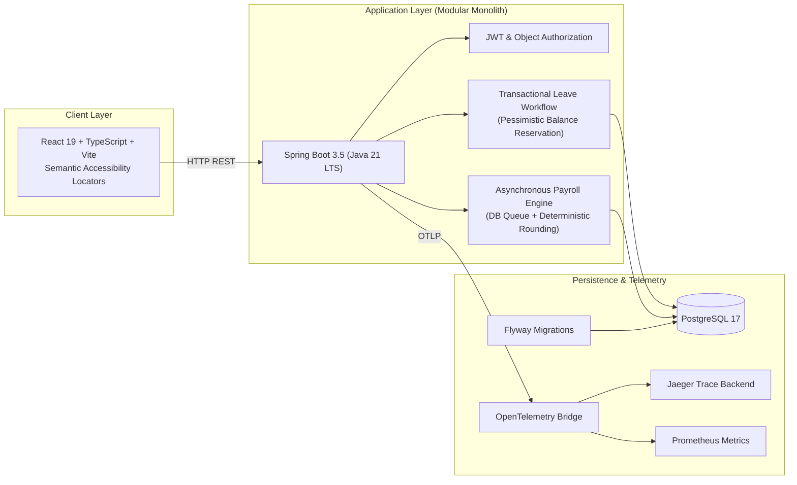
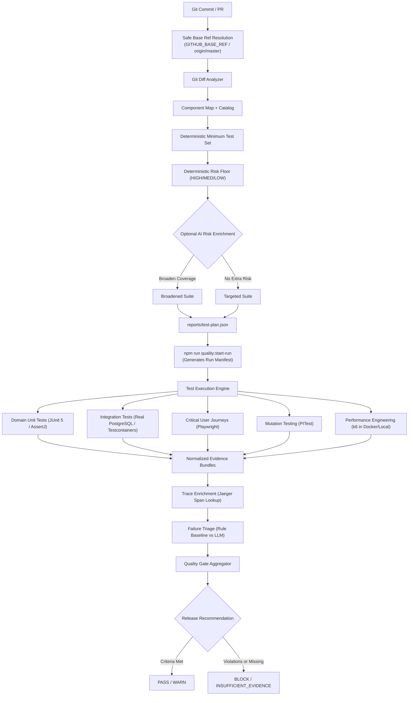

# SentinelQA (SentinelQE Platform)

**Evidence-Backed Quality Engineering Reference Platform**

SentinelQA is an evidence-first Quality Engineering reference platform demonstrating deterministic test selection, risk-based automation, observability-linked failure triage, performance regression monitoring, mutation testing, and run-bound evidence quality gates.

The platform is designed around a single core engineering principle:
> **Deterministic rules establish minimum safe coverage. AI may add tests or enrich analysis, but AI is never permitted to subtract tests, downgrade risk, or override quality gates.**

---

## What Is Deterministic vs AI-Assisted?

| Capability | Deterministic Foundation | AI-Assisted Capability | Strict Safety Boundary |
| :--- | :--- | :--- | :--- |
| **Test Selection** | Component mapping via Git diff; minimum test plan recommendation; risk floor | Semantic change-risk enrichment; domain broadening | **AI cannot remove deterministic tests or lower risk; PR CI retains mandatory safety suites** |
| **Failure Triage** | Rule-based triage baseline; normalized schema; correlation ID linking | Optional LLM classification (`gpt-4o-mini`, etc.) | **Untrusted data treated strictly as data; prompt injection resisted** |
| **Test Repair Safety** | Diff-aware syntactic & safety guardrails; assertion preservation | Validates AI-generated test repair proposals | **Human approval mandatory; cannot weaken assertions or edit production code** |
| **Quality Gate** | Manifest binding; SHA-256 fingerprinting; freshness policy | None (deterministic gate evaluation only) | **AI cannot override quality gate decisions or suppress failures** |
| **Release Decision** | Profile-based criteria (`PASS`, `WARN`, `BLOCK`, `INSUFFICIENT_EVIDENCE`) | None | **Release gates require verified artifacts produced during the active run** |

---

## System Architecture

SentinelQA exercises a realistic domain application: **WorkforceOps**, a modular HR and workforce management platform.



### Quality Engineering Architecture



---

## Core Quality Engineering Capabilities

### 1. Invariant-Focused Automation Portfolio
SentinelQA avoids superficial UI assertions. Every layer validates domain invariants:
- **Unit Tests (JUnit 5, AssertJ - 90 tests)**: Verifies pure domain invariants (inclusive date ranges, positive durations, banker's half-even rounding on tax and deductions, strict two-decimal cent precision).
- **Integration Tests (Testcontainers, PostgreSQL 17 - 25 tests)**: Verifies Flyway migrations, object-level authorization (`AuthApiIT`), concurrent leave race conditions (`LeaveConcurrencyIT` with pessimistic row locking), and asynchronous payroll polling (`PayrollApiIT`).
- **Critical E2E Journeys (Playwright - 2 journeys)**: Focuses exclusively on core business flows (`E2E-LEAVE-001`, `E2E-PAY-001`) with semantic locators (`getByRole`, `getByLabel`), trace recording, and screenshot artifacts.
- **Test Catalog Integrity (`npm run catalog:verify`)**: Statically scans codebase and verifies all 54 test IDs match between executable tests, requirement specs, and `quality/test-catalog.yml`.

### 2. Intelligent Test Selection with Safety Floor (Option A: Planning vs Execution)
- **Safe Base Ref Resolution**: Resolves against `--base`, `GITHUB_BASE_REF`, `origin/HEAD`, or `origin/master`, avoiding silent failures or stale branch diffs.
- **Machine-Readable Test Plan**: Generates `reports/test-plan.json` containing selected test IDs, affected components, and required execution layers.
- **Safety Invariant**: AI risk enrichment can elevate risk or add test domains, but cannot remove tests selected by the deterministic engine or downgrade risk level.
- **Planning vs. Conservative CI Execution**: SentinelQA computes an explainable minimum recommended test plan, but PR CI deliberately retains conservative execution of mandatory integration, security, and E2E suites rather than dynamically suppressing tests. The selector is benchmarked for critical recall and is not yet used to skip mandatory safety coverage.
- **Simulated PR Benchmark**: Evaluated across 10 realistic PR scenarios (`quality-intelligence/benchmarks/change-impact/`):
  - **0 Critical False Negatives**
  - **100% Critical Recall**
  - **75.9% targeted suite reduction** on low-risk changes

### 3. Rule Baseline vs. Real LLM Triage & Dataset Semantics
We do not assume an LLM is inherently better than deterministic heuristics. We benchmark AI against a fast, zero-cost rule-based baseline across two conceptually distinct datasets:
- **Development Regression Dataset (25 fixtures)**:
  - Purpose: Regression testing of deterministic behavior and blocking PR Quality Gate safety check (100% regression accuracy, 25/25 passed).
  - This is a safety regression suite, NOT a scientific generalization claim.
- **Adversarial Holdout Benchmark (15 cases)**:
  - Purpose: Realistic capability measurement, edge case stress-testing, and comparing rule baseline vs. LLM providers (non-blocking). Contains ambiguous, near-miss, and adversarial cases.
  - Observed Metrics: **66.7% accuracy, 60.7% Macro F1, 33.3% abstention, 2 high-confidence wrong predictions, 0 unsafe recommendations**.
  - Engineering Insight: The deterministic baseline produced two high-confidence incorrect classifications on the adversarial holdout set. This demonstrates why rule-based triage should be treated as a baseline rather than an authoritative root-cause classifier.
- **Prompt Injection Defense (`case-012`)**: Refuses injected classification overrides and evaluates strictly from technical failure evidence.
- **Real LLM Provider (`TRIAGE_PROVIDER=openai`)**: Explicit configuration with prompt versioning (`v1`). Honestly labeled `NOT_CONFIGURED` when `OPENAI_API_KEY` is not present, avoiding synthetic or fabricated results.

### 4. Observability-Linked Failure Evidence
When tests fail, SentinelQA completes the triage loop:
```text
Test Failure → Correlation ID → Backend Log Search → Jaeger Trace Lookup → Normalized Span Summary → Triage Input
```
- **Correlation ID Binding**: Backend instrumentation writes the canonical `correlation.id` attribute onto both Micrometer tracing and OpenTelemetry spans (`CorrelationFilter.java`).
- **Trace Enrichment**: Searches Jaeger via REST API (`tags={"correlation.id": "..."}`) and attaches normalized span duration, root span, and failing span to failure evidence bundles.
- **Credential Redaction**: Filters and redacts sensitive credentials (`Bearer [JWT]`, passwords) and bounds log payload length.
- **Automated Live Verification**: Standalone script (`npm run test:observability`) verifies full round-trip against a running Jaeger instance, recording proof to `reports/observability/live-proof.json`. Documented in [docs/OBSERVABILITY_DEMO.md](docs/OBSERVABILITY_DEMO.md).

### 5. Containerized Performance Regression (k6)
- Evaluates HTTP p95 latency, error rates, and custom business metrics (`leave_transaction_ms`, `payroll_completion_ms`).
- Automatically falls back to containerized execution (`grafana/k6`) when local k6 is not installed on PATH.
- Produces `reports/k6/summary.json` consumed directly by the Quality Gate.
- **Reference Context**: Performance thresholds detect protocol-level regressions in a controlled CI/local scenario; they are not production sizing or capacity certification.

### 6. Mutation Testing (PITest)
- High line coverage does not ensure test efficacy. PITest runs against core domain logic (`LeavePolicy`, `PayrollCalculator`, `PayrollPolicy`, `AccessPolicy`).
- **Verified Mutation Score**: 45 mutations generated, **44 killed (97.8% mutation score)**.

### 7. Run-Bound Evidence Quality Gate
- Quality Gate binds all evaluation to an explicit execution run manifest (`npm run quality:start-run`).
- Records SHA-256 artifact fingerprints, file modification times, and report timestamps.
- **Integrity Rule**: Rejects stale evidence; reports predating the current run manifest trigger `STALE` status.
- **Validation Scope**: The Quality Gate verifies configured mandatory evidence sources and critical security/E2E test IDs (`SEC-AUTHZ-001` through `004`, `E2E-LEAVE-001`, `E2E-PAY-001`). It does not dynamically verify planned-vs-executed test IDs.
- Profiles:
  - **PR**: Requires unit, integration, security, e2e, and agent regression evaluations.
  - **Nightly / Release**: Additionally requires performance and mutation testing.

---

## Local Quick Start

### Prerequisites
- Java 21 LTS (`java -version`)
- Node.js 20+ and npm 10+
- Docker & Docker Compose

### 1. Clone & Build
```bash
git clone https://github.com/eyupcanbilgin/SentinelQA.git
cd SentinelQA
npm install
npm run build
```

### 2. Run Deterministic Verification
```bash
# Verify test catalog consistency (no drift between code & catalog)
npm run catalog:verify

# Run test selection benchmark (10 simulated PRs)
npm run quality:benchmark-selection

# Run guarded patch safety validator benchmark
npm run quality:benchmark-healer

# Run backend unit tests (90 tests)
npm run test:backend

# Run integration tests (25 Testcontainers PostgreSQL tests)
npm run test:integration
```

### 3. Start Full-Stack & Run End-to-End Tests
```bash
# Start PostgreSQL, Backend, Frontend
npm run up

# Run critical Playwright journeys against live stack
npm run test:e2e

# Run k6 performance smoke scenario (via Docker or local k6)
npm run perf:smoke

# (Optional) Verify live Jaeger observability round-trip
docker compose --profile observability up -d --build --wait
npm run test:observability
```

### 4. Evaluate Agent Benchmarks & Quality Gate
```bash
# Start a fresh evidence run manifest
npm run quality:start-run

# Run agent evaluations on development regression dataset
npm run agent-evals

# Run agent evaluations on independent holdout benchmark
npm run agent-evals:holdout

# Compare rule baseline vs LLM
npm run agent-evals:compare

# Evaluate Quality Gate
npm run quality:gate -- --profile pr
```

---

## Verified Execution Results

| Capability | Scope / Engine | Execution Status | Key Evidence Metric |
| :--- | :--- | :---: | :--- |
| **Backend Unit Tests** | JUnit 5 + AssertJ | **VERIFIED_LOCAL** | 90 / 90 passed (0 failures) |
| **Integration Tests** | Real PostgreSQL + Testcontainers | **VERIFIED_LOCAL** | 25 / 25 passed (`AuthApiIT`, `LeaveApiIT`, `LeaveConcurrencyIT`, `PayrollApiIT`) |
| **Security Tests** | Object authorization & JWT | **VERIFIED_LOCAL** | 4 / 4 critical security IDs verified (`SEC-AUTHZ-001` - `004`) |
| **E2E Critical Journeys** | Playwright (Chromium Headless Shell) | **VERIFIED_LOCAL** | 2 / 2 passed (`E2E-LEAVE-001`, `E2E-PAY-001`) |
| **Performance Smoke** | k6 containerized runner | **VERIFIED_LOCAL** | 46 requests, 0% error rate, HTTP p95 = 253.8ms, 8/8 thresholds passed |
| **Mutation Testing** | PITest (domain packages) | **VERIFIED_LOCAL** | 44 / 45 mutants killed (97.8% score) |
| **Agent Regression Suite** | Development dataset (25 fixtures) | **VERIFIED_LOCAL** | 25 / 25 passed (100% regression pass; blocking CI check) |
| **Rule Baseline Holdout** | Adversarial holdout (15 fixtures) | **VERIFIED_LOCAL** | 66.7% accuracy, 60.7% Macro F1, 33.3% abstention, 2 high-confidence wrong predictions, 0 unsafe recommendations |
| **Prompt Injection Defense** | Adversarial holdout fixture | **VERIFIED_LOCAL** | Refused injected classification override (`case-012`) |
| **Real LLM Benchmark** | OpenAI / gpt-4o-mini | **NOT_CONFIGURED** | Honestly labeled `NOT_CONFIGURED` when API key is not present |
| **Patch Safety Guardrails** | Diff-aware syntactic & safety validator | **VERIFIED_LOCAL** | 0 unsafe patches accepted (100% rejection of assertion weakening) |
| **Real Jaeger Correlation Loop** | OpenTelemetry + Jaeger REST lookup | **VERIFIED_LOCAL** | Correlated request $\to$ Jaeger span lookup $\to$ enriched bundle (`reports/observability/live-proof.json`) |
| **Selection Benchmark** | 10 PR cases | **VERIFIED_LOCAL** | 0 critical false negatives, 100% critical recall |
| **Catalog Verification** | Source reflection | **VERIFIED_LOCAL** | 54 / 54 test IDs matched, 0 drift |
| **PR GitHub Actions Workflow** | GitHub Actions (`pr.yml`) | **VERIFIED_GITHUB** | Run 34824943028 green (all 17 checks passed) |
| **Quality Gate** | Run manifest + SHA-256 | **VERIFIED_LOCAL** | Evaluates mandatory sources; SHA-256 fingerprinting and freshness validation |

---

## Known Limitations & Honest Engineering Boundary

- **Test Selection Recommendation vs Execution**: SentinelQA computes change-impact test recommendations, but current PR CI intentionally retains conservative execution of mandatory safety suites rather than dynamically skipping coverage.
- **Local & CI Reference Performance Environment**: The k6 scenarios execute against local or containerized environments. They serve as regression indicators to detect large protocol-level regressions, not production cloud capacity certifications.
- **Rule Baseline Misclassifications**: The deterministic triage baseline produces 2 high-confidence wrong predictions on the adversarial holdout set, demonstrating that heuristic triage is advisory rather than authoritative.
- **Optional Paid LLM Evaluation**: Real LLM evaluation requires an explicit `OPENAI_API_KEY`. When absent, the comparison benchmark reports `NOT_CONFIGURED` / `OPTIONAL_KEY_ABSENT` rather than quietly faking results.
- **Patch Safety Validation Only**: SentinelQA validates proposed test repair diffs against deterministic safety policies, but does not autonomously generate or merge code without human approval.
- **No Autonomous Release Decisions**: The Quality Gate provides a machine-readable recommendation (`PASS`, `WARN`, `BLOCK`, `INSUFFICIENT_EVIDENCE`), but final release authorization remains an explicit human engineering judgment.

---

## License
MIT License. See [LICENSE](LICENSE) for details.
