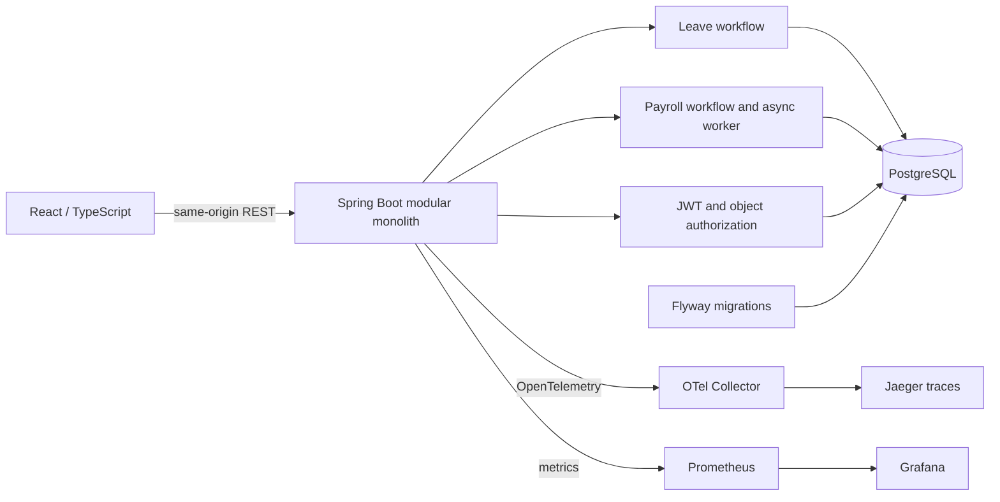
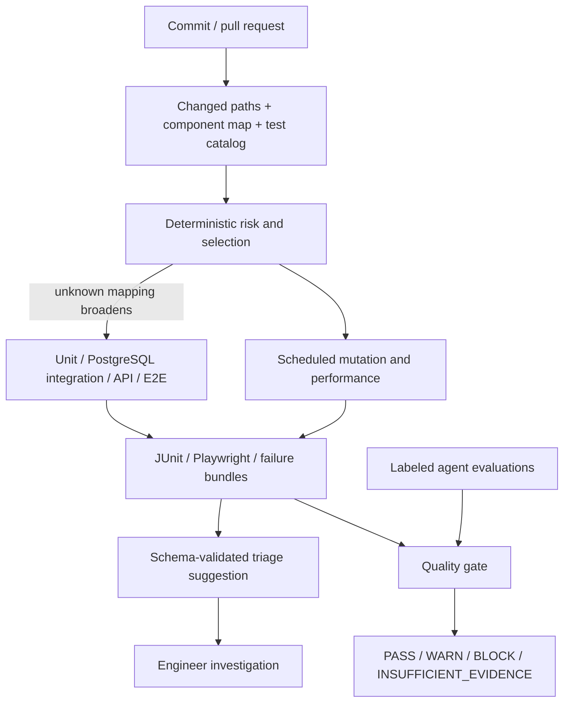

# Architecture

SentinelQE is a quality engineering reference platform built around WorkforceOps, a fictional HR application. The application creates realistic authorization, transaction, asynchronous processing and money-calculation risks. The quality system turns those risks into executable checks and reviewable release evidence.

The browser uses a Vite proxy in development and an nginx proxy in Compose. Business validation and authorization live in the backend; hiding a frontend button is only a usability aid. PostgreSQL is the only durable store. Flyway owns schema changes and Hibernate validates the mapped schema. See [API_CONTRACT.md](API_CONTRACT.md) for endpoint shapes and policies.

| Choice | Purpose and cost |
| --- | --- |
| Java, Spring Boot, Maven | One backend runtime for domain logic, transactions and Java API/integration tests. |
| PostgreSQL, Flyway, JPA | Real relational constraints and migrations; integration tests need a database runtime. |
| React, TypeScript, Vite | A small accessible UI for critical workflows; money is displayed from decimal strings. |
| Playwright | Browser journeys, semantic locators and trace evidence; intentionally narrower coverage than API tests. |
| REST Assured, JUnit, Testcontainers | HTTP contracts plus assertions against real PostgreSQL state without substituting H2. |
| PIT | Checks whether domain assertions detect meaningful code mutations. |
| k6 | Protocol load and asynchronous completion measurements; no browser VU farm. |
| OpenTelemetry, Collector, Prometheus, Grafana, Jaeger | Correlate failing requests with server work and inspect a small set of operational signals. Optional local profile keeps basic startup light. |
| TypeScript quality tooling | Reuses the frontend/tooling runtime for deterministic selection, structured triage, evaluation and evidence aggregation. |

One deployable backend is deliberate. Leave approval and balance mutation need a shared transaction, while payroll writes must be consistent with run state. Microservices, message brokers and Kubernetes would add failure modes without a product requirement. Modules are source-level boundaries, not independently deployed services or a claim of enforced package isolation.

The main relationships are `users → employees → departments`, an optional employee self-reference for a manager, one balance per employee, and many leave requests per employee. Payroll runs own payroll items; each item references an employee. Audit events record meaningful mutations. Unique payroll periods, foreign keys and transactional state checks protect invariants below the HTTP layer.

Leave dates are inclusive calendar dates: same-day leave costs one day; weekends count. There are no holiday calendars, half days, accrual, carry-over, statutory entitlements or time zones in the calculation. Pending requests reserve entitlement so several individually valid requests cannot collectively overspend. A pessimistic write lock on the employee's balance serializes reservations. `availableDays` is stored `available_days - reserved_days`, so the API's spendable amount falls when a request is created. Final approval consumes the reservation and decrements stored entitlement; rejection releases the reservation without consuming entitlement. Decision paths lock the leave row, then the balance, in one transaction so replay cannot decrement twice. Self-approval is forbidden even for elevated roles. Employees with a manager start at `PENDING_MANAGER`; manager approval advances to `PENDING_HR`. Managerless employees begin at `PENDING_HR`. Final decisions are immutable. See [ADR-008](adr/008-domain-invariants.md).

Payroll is an asynchronous database-backed workflow. Submission changes a run to persisted `PROCESSING` with a queue timestamp; the client polls status before finalizing. The worker claims eligible rows with `SKIP LOCKED`, calculates and persists items and marks completion in one transaction. A process restart rolls back unfinished work, leaving the persisted queue row available to the next worker pass. This avoids an in-memory-only job that vanishes on restart; it is not a claim of distributed exactly-once delivery. A unique period prevents duplicate runs. `BigDecimal` computes a fictional flat 20% tax and 5% deduction, each rounded `HALF_UP` to two decimal places. Net pay is base minus rounded tax minus rounded deductions. Money crosses the JSON boundary as decimal strings. This is a reproducible test model, not a jurisdictional payroll system.

Selection explains which tests relate to changed components. Required critical checks remain a CI floor; an LLM cannot remove them. Triage is an investigation aid, not a root-cause verdict. The gate reads actual artifacts and distinguishes missing evidence from success. A release recommendation supports the engineer who accepts release risk; it does not deploy the product or certify safety.

A useful investigation starts with the stable test ID and expected/actual business state, then follows `X-Correlation-ID` from the failed HTTP exchange to backend logs and its trace ID. Request logs should be inspected with the corresponding trace, not treated as a substitute for transaction state. Trace/screenshot paths are evidence references, not proof that the triage provider inspected their contents.

This is a single-organization reference system. It has no tenant boundary, identity provisioning product, statutory payroll rules, production disaster recovery or external notification service. Demo credentials exist only for the `demo` profile. See [SECURITY_TESTING.md](SECURITY_TESTING.md) and the current [FINAL_VERIFICATION.md](FINAL_VERIFICATION.md) for scope and execution evidence.
